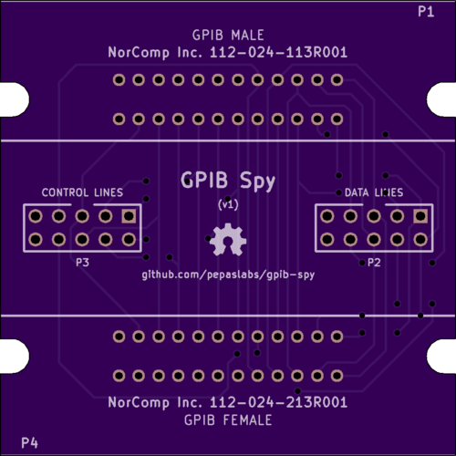
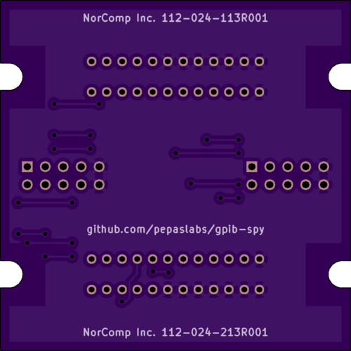

# gpib-spy
A GPIB pass-through board with connectors for logic analyzers.

# Status

This board is untested.

# Board design v1

Initial board design.

## Gerbers

[gerbers.zip](kicad/releases/v1/gerbers.zip)

## Schematic

[PDF](kicad/releases/v1/gpib-spy-schematic.pdf).

## Parts

* P1: Male GPIB connector
  * Norcomp Inc. 112-024-113R001
  * [$5.00 at digikey](https://www.digikey.com/product-detail/en/norcomp-inc/112-024-113R001/1024RMA-ND/955155)

* P2, P3: IDC box header, 5x2, 0.1"
  * [$0.48 at digikey](https://www.digikey.com/product-detail/en/cnc-tech/3020-10-0100-00/1175-1609-ND/3441723)
  * [$0.14 at tayda](https://www.taydaelectronics.com/connectors-sockets/box-header-connectors/10-pin-box-header-connector-2-54mm.html)
  * or search ebay for ["idc 2x5 box header"](https://www.ebay.com/sch/i.html?_nkw=idc+2x5+box+header)

* P4: Female GPIB connector
  * Norcomp Inc. 112-024-213R001
  * [$5.15 at digikey](https://www.digikey.com/product-detail/en/norcomp-inc/112-024-213R001/1024RFA-ND/955159)

# License

This board design is [Open-Source Hardware](http://www.oshwa.org/definition/).  It is licensed under the [MIT License](http://opensource.org/licenses/MIT).  It was designed by Jason Pepas.

# Thanks

Thanks to [Steven Casagrande](http://steven.casagrande.io/) of [Galvant Industries](https://github.com/Galvant) for [releasing](https://github.com/Galvant/gpibusb-pcb) his [GPIB-to-USB adapter](http://www.galvant.ca/) as open source hardware.  Using a few of his KiCAD footprints saved me a lot of time!
